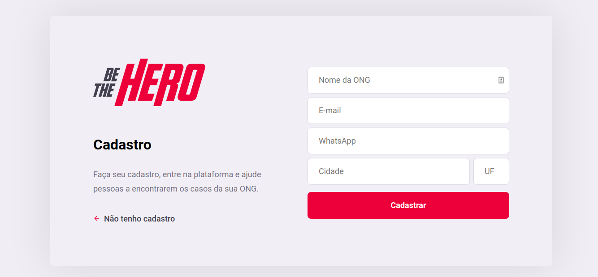

# Aplicativo beTheHero

Aplicativo construído em NodeJs, React e React Native para desktop e mobile (Android e IOS), no qual permite conectar voluntários a ONGs.
 
Possui a versão web e mobile.

Esse projeto é o resultado da semana Omnistack 11 ministrado pela Rocketseat.

## Telas

## Contribuição

1. Fork it (<https://github.com/yourname/yourproject/fork>)
2. Create your feature branch (`git checkout -b feature/fooBar`)
3. Commit your changes (`git commit -am 'Add some fooBar'`)
4. Push to the branch (`git push origin feature/fooBar`)
5. Create a new Pull Request

